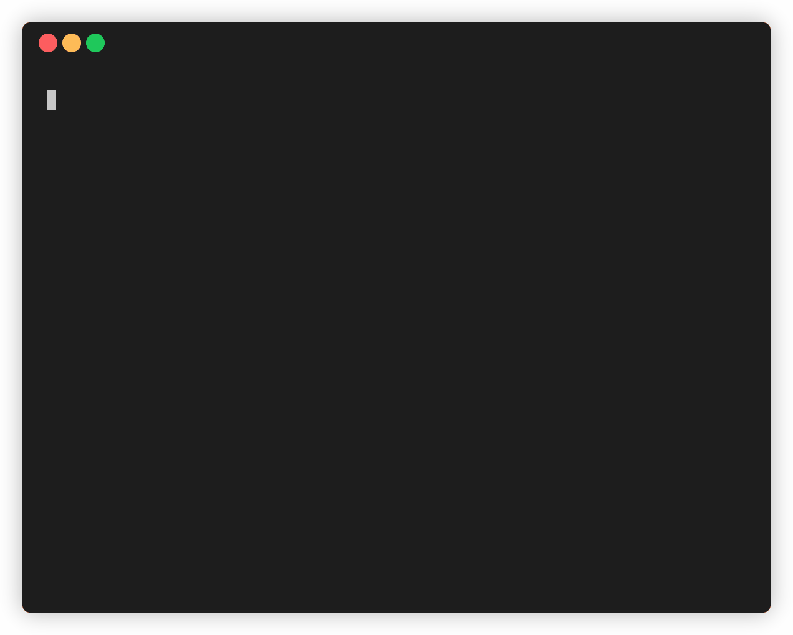

# Highlights

This shell script captures a screenshot of the desktop at a set interval.



## Usage

Use the default interval of 30 seconds
```
./highlights.sh
```

Set the interval
```
./highlights.sh -t 10
```

## Requirements

- Mac OS X
